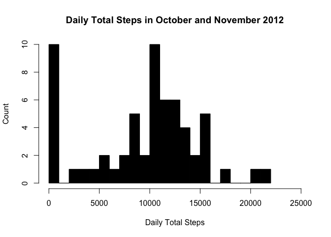
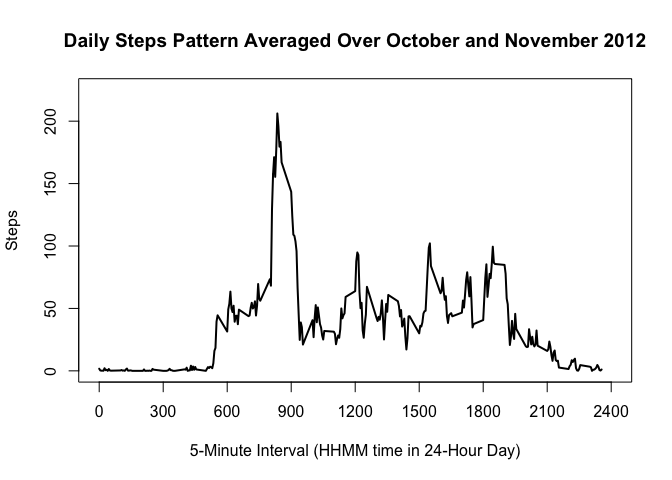
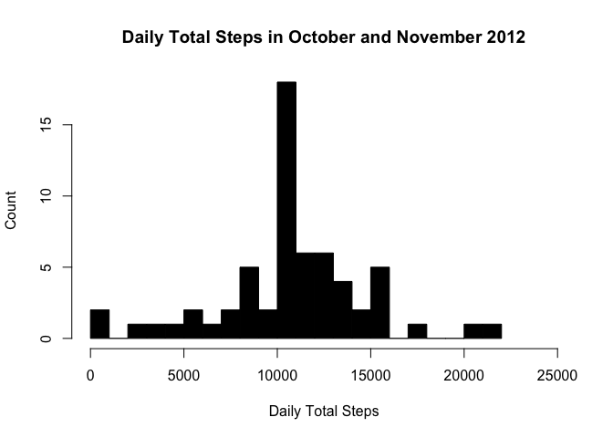
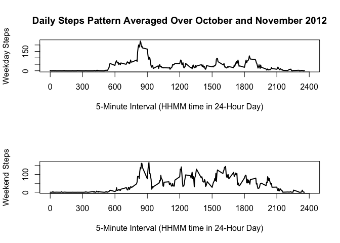

# Reproducible Research: Peer Assessment 1, Steps

## Loading and preprocessing the data

```r
# Set working directory to location of data file.
setwd("/Users/martin/data_science/Reproducible_Research/week_2_project")
# Read data file using the read.csv() function.
steps <- read.csv("activity.csv")
```

## What is mean total number of steps taken per day?

```r
# Compute daily total steps.
steps_daily_total <- tapply(steps$steps, steps$date, sum, na.rm = TRUE)
```

```r
# Make histogram of daily total steps.
hist(steps_daily_total, seq(from = 0, to = 22000, by = 1000), col = "black", 
     xlab = "Daily Total Steps", ylab = "Count", 
     main = "Daily Total Steps in October and November 2012",
     xlim = c(0, 25000))
```

<!-- -->


```r
# Compute mean and median daily total steps.
mean_steps_daily_total <- mean(steps_daily_total)
median_steps_daily_total <- median(steps_daily_total)
```

The mean daily total steps is 9354.2.  
The median daily total steps is 10395.

## What is the average daily activity pattern?

```r
# Determine the average daily activity pattern by computing average across 
# all days at the 5-minute intervals.
steps_daily_pattern <- tapply(steps$steps, steps$interval, mean, na.rm = TRUE)
intervals <- unique(steps$interval)
```


```r
# Make a time series plot (i.e. type = "l") of the 5-minute interval (x-axis) 
# and the average number of steps taken, averaged across all days (y-axis)
plot(intervals, steps_daily_pattern, type = "l", lwd = 2,
     xlab = "5-Minute Interval (HHMM time in 24-Hour Day)", ylab = "Steps",
     main = "Daily Steps Pattern Averaged Over October and November 2012",
     xlim = c(0,2400), xaxp = c(0, 2400, 8),
     ylim = c(0, 225))
```

<!-- -->


```r
## Determine which 5-minute interval, on average across all the days in the 
## dataset, contains the maximum number of steps
interval_max <- intervals[steps_daily_pattern == max(steps_daily_pattern)]
```
The time interval with the most steps on average is 835, that is, 
8:35 AM.

## Imputing missing values

```r
# Calculate and report the total number of missing values in the dataset 
# (i.e. the total number of rows with NAs)
num_missing_values <- sum(is.na(steps$steps))

# Fill in all of the missing values in the dataset.
# Use the mean for each 5-minute interval.
steps_vec_noNAs <- steps$steps
steps_use_to_fill <- rep(steps_daily_pattern,
                    times = length(steps_vec_noNAs)/length(steps_daily_pattern))
steps_vec_noNAs[is.na(steps_vec_noNAs)] <- 
                                       steps_use_to_fill[is.na(steps_vec_noNAs)]

# Create a new dataset that is equal to the original dataset 
# but with the missing data filled in.
steps_noNAs <- steps
steps_noNAs$steps <- steps_vec_noNAs
```
There are 2304 missing values (NAs). These have been imputed 
using the mean for each 5-minute interval.


```r
# Compute daily total steps.
steps_noNAs_daily_total <- tapply(steps_noNAs$steps, steps$date, sum)
```


```r
# Make histogram of daily total steps.
hist(steps_noNAs_daily_total, seq(from = 0, to = 22000, by = 1000), 
     col = "black", 
     xlab = "Daily Total Steps", ylab = "Count", 
     main = "Daily Total Steps in October and November 2012",
     xlim = c(0, 25000))
```

<!-- -->


```r
# Compute and display mean and median daily total steps.
mean_steps_noNAs_daily_total <- mean(steps_noNAs_daily_total)
median_steps_noNAs_daily_total <- median(steps_noNAs_daily_total)
```

The mean daily total steps without NAs is 10766.2.  
The median daily total steps without NAs is 
10766.2.  
These values differ from the estimates in the first part of the assignment when 
the NAs were left in. The impact of imputing the NAs on the estimates of the 
total daily number of steps is that they increase. Before there were days with
data missing at all intervals and use of "na.rm = TRUE" caused the daily total
to be 0 on these days. The imputing results in daily totals increasing to more
reasonable values.

## Are there differences in activity patterns between weekdays and weekends?

```r
# Create a new factor variable in the dataset with two levels – 
# “weekday” and “weekend” indicating whether a given date is a 
# weekday or weekend day.
dow <- weekdays(as.Date(steps_noNAs$date))
week_part <- rep("weekday", length(dow))
week_part[dow == "Saturday" | dow == "Sunday"] <- "weekend"
steps_noNAs$week_part <- as.factor(week_part)

# Determine the weekday and weekend average daily activity patterns
# by computing averages at the 5-minute intervals
steps_daily_pattern_weekday <- tapply(steps_noNAs$steps[week_part == "weekday"], 
                                      steps$interval[week_part == "weekday"], 
                                      mean)
steps_daily_pattern_weekend <- tapply(steps_noNAs$steps[week_part == "weekend"], 
                                      steps$interval[week_part == "weekend"], 
                                      mean)
```


```r
## Make a panel plot containing a time series plot (i.e. type = "l") of the 5-minute interval
## (x-axis) and the average number of steps taken, 
## averaged across all weekday days or weekend days (y-axis).
par(mfcol = c(2,1))
plot(intervals, steps_daily_pattern_weekday, type = "l", lwd = 2,
     ylab = "Weekday Steps",
     xlab = "5-Minute Interval (HHMM time in 24-Hour Day)",
     main = "Daily Steps Pattern Averaged Over October and November 2012",
     xlim = c(0,2400), xaxp = c(0, 2400, 8)
     )
plot(intervals, steps_daily_pattern_weekend, type = "l", lwd = 2,
     xlab = "5-Minute Interval (HHMM time in 24-Hour Day)", 
     ylab = "Weekend Steps",
     xlim = c(0,2400), xaxp = c(0, 2400, 8)
     )
```

<!-- -->
  
There is more step activity on the weekend, especially in the middle of the day.
